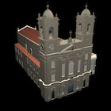

Back in 2006 the Associação Porto Digital made a public contest where the participantes had to model emblematic building of Porto, in 3D.  
We took our best shoot and ended up achieving the "Prémio Escola" (School prize)

For more information about this project check the following link.  
[3D modeling of Igreja da Lapa - website](http://paginas.fe.up.pt/~necg/sites/Porto3D/) (in Portuguese)

**Authors**:  
Tiago Fernandes, João Tapio Leppanen, José Pedro Neves
